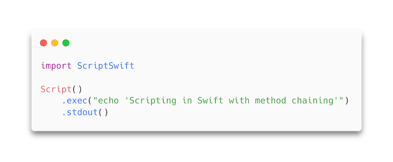

# Script.swift
[](https://swiftpackageindex.com/KS1019/Script.swift)
[](https://swiftpackageindex.com/KS1019/Script.swift)

Script.swift is a small library that lets you write a Swift script with ease by using method chaining, inspired by [bitfield/script](https://github.com/bitfield/script).



## Install
**Via Swift Package Manager**

Add this line in `dependencies` of your `Package.swift`.
```swift
.package(url: "https://github.com/KS1019/Script.swift", from: "0.0.1")
```

**Via [`swift-sh`](https://github.com/mxcl/swift-sh)**

Add this line at the top of your Swift script. Refer to swift-sh documentation for more details.
```swift
import ScriptSwift // KS1019/Script.swift ~> 0.0.1
```
## Usage

| Method | Contents |
| ------ | -------- |
| `exec` | Executes commands |
| `ifExists` | Continues only if a file exists |
| `write` | Writes data to a file |
| `read` | Reads data from a file |
| `countLines` | Returns the number of lines |
| `concat` | Returns an array of string representation of files |
| `asArray` | Returns lines of a string as an array |

See [documentation](https://ks1019.github.io/Script.swift/documentation/ScriptSwift/) for more details.

### Using `Script.swift` with [`swift-sh`](https://github.com/mxcl/swift-sh)
When you want a script, you typically want it in a single file. With usual setup using Swift Package Manager to interact with external libraries, you would end up a directory with `Package.swift`, which is bit much as a script.

By using `swift-sh`, you only have to take care of a single Swift file for your script, which makes your Swift script as portable as possible.
## Examples
<table>
<thead>
  <tr>
    <th>Source</th>
    <th>Script</th>
  </tr>
</thead>
<tbody>
<tr>
<td>

[`echo.swift`](https://github.com/KS1019/Script.swift/blob/3c6d94df1482cc9c6f47f9f1e43b99f8f16a765b/Examples/echo.swift)

</td>
<td>
      
```swift
Script()
    .exec(#"echo "testing""#)
    .stdout()
```
      
</td>

</tr>
</tbody>
</table>

## Acknowledgements
- [JohnSundell/Files](https://github.com/johnsundell/files)
- [JohnSundell/ShellOut](https://github.com/johnsundell/shellout)
- [mxcl/swift-sh](https://github.com/mxcl/swift-sh)
- [bitfield/script](https://github.com/bitfield/script)
